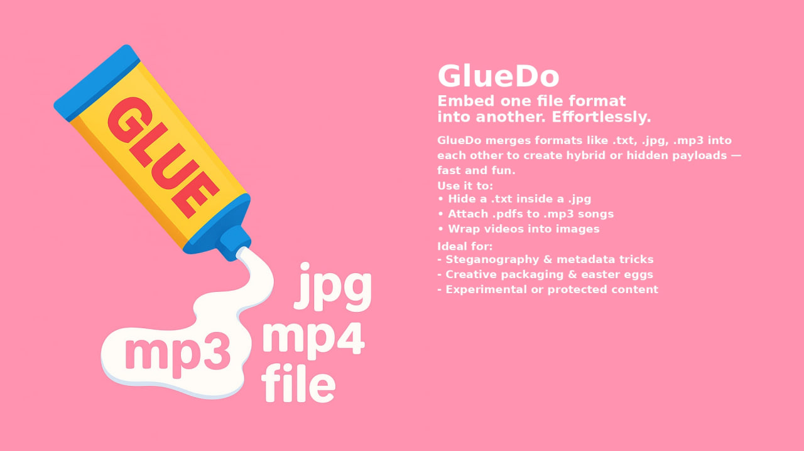

# GlueDo — File-in-File Hider Tool  


> Cross-platform desktop tool for hiding one file inside another — and later extracting it back.  
> GUI-based. Open-source. Manually built with clear logic and assistant-optimized workflow.

---

# 📌 What it does

GlueDo lets you **embed one or more files** (e.g., ZIP, PDF, JPG) **inside another** file (e.g., MP3, PNG, TXT)  
You can later extract the hidden content — preserving the original file’s visibility and format.

Use cases:
- Hide a document in an MP3 to create an “audio document”
- Embed an archive inside an image (e.g., PNG)
- Extract hidden files even if just one side remains

---

# ⚙ How to use

### 🟢 GUI Version (Recommended)
1. Launch `gluedo_gui.exe`
2. Drag files into the left and right panels
3. Use the arrow buttons:
   - ➡ to embed left file(s) into the right
   - ⬅ to embed right file(s) into the left
   - If only one panel is filled — triggers extraction
4. Save the result

### 🐍 From source:
```bash
pip install PyQt5
python gui.py
```

---

# 🧠 Key Features

- Drag & drop GUI (PyQt5)
- File thumbnails & clear/reset buttons
- Multi-language UI (18 languages)
- Embeds multiple files as ZIP
- Config file remembers chosen language
- Smart detection of hidden content

---

# 🧪 Status

- ✅ Core logic tested
- ✅ GUI stable
- 🟡 Localization system ready, `.po` files in `locales/` (needs full compile)

---

# 📖 License & Attribution

> 📝 Licensed under **GNU GPLv3**  
> You may use, modify, and redistribute this software freely if you:
- Keep the license (GPLv3)
- Mention the original author
- Share source code of modified versions

> 🧩 The project was designed and built manually by the author.  
Some assistants and dev tools were used to optimize the workflow,  
but logic, UI, and structure were fully authored and tested manually.

🧑 Author: Egorin Eugene Alexandrovich  
📅 Year: 2025  
🔗 GitHub: [wonderMoronWins](https://github.com/wonderMoronWins)

---

# GlueDo — Программа для скрытия файлов внутри других

> Кроссплатформенная программа с графическим интерфейсом, позволяющая встраивать файлы друг в друга — и извлекать их обратно.

---

## 📌 Что делает программа

GlueDo позволяет **встраивать один или несколько файлов** (ZIP, DOCX, JPG) **в другой** файл (MP3, PNG, PDF и др.)

Примеры:
- Спрятать ZIP в MP3 — «аудио-документ»
- Встроить PDF в изображение
- Извлечь спрятанный файл из носителя

---

## ⚙ Как пользоваться

**🟢 Графический интерфейс**:
1. Запустить `gluedo_gui.exe`
2. Перетащить файлы в левую и правую рамки
3. Использовать стрелки:
   - ➡ вшить слева → направо
   - ⬅ справа → налево
   - Если заполнена только одна рамка — запускается извлечение
4. Сохранить результат

**🐍 Из исходников:**
```bash
pip install PyQt5
python gui.py
```

---

## 💡 Особенности

- Drag-n-drop интерфейс
- Миниатюры файлов и кнопки очистки
- Поддержка 18 языков
- Автоматическое создание ZIP при встраивании нескольких файлов
- Умная логика: "ФАЙЛ ПУСТ" и "ФАЙЛ НЕ СОДЕРЖИТ ДРУГОЙ ИНФОРМАЦИИ"

---

## 🧪 Статус

- ✅ Основной функционал завершён
- ✅ GUI работает стабильно
- 🟡 Локализация подготовлена, требует компиляции `.po`

---

## 📖 Лицензия и авторство

> 📝 Лицензия: **GNU GPLv3**  
> Разрешено использование, переработка, распространение:
- С указанием автора
- С сохранением лицензии
- С открытым кодом при модификации

> 🧩 Проект разработан вручную, на базе личной архитектуры.  
При этом использовались вспомогательные инструменты и код-ассистенты — для ускорения, улучшения шаблонов и UI.  
Логика, структура и интерфейс — авторские, тщательно проверены вручную.

🧑 Автор: Егорин Евгений Александрович  
📅 Год: 2025  
🔗 GitHub: [wonderMoronWins](https://github.com/wonderMoronWins)
